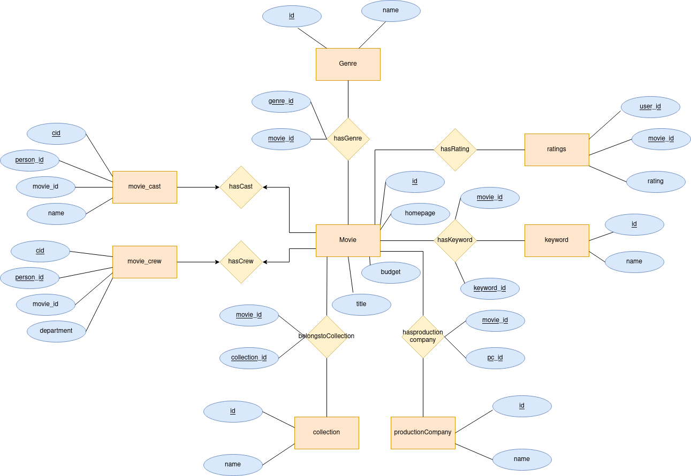
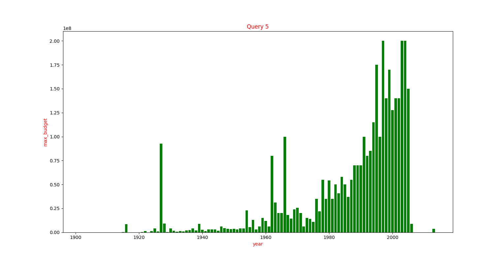

# Database Management System

# Exercise 1

* **Python script** to normalize database tables to 2 Normal Form
* **SQL queries** to add Primary and Foreign Key to database tables

# Exercise 2

* **12 SQL queries** to retrieve information from the database

# Exercise 3

* Designed Entity Relationship Diagram



# Project

* Visualizations of SQL queries data

* Example

* ```sql
  SELECT YEAR(m.release_date) as year, MAX(m.budget) as max_budget
  FROM movie m 
  WHERE m.budget != 0
  GROUP BY YEAR(m.release_date)
  ORDER BY YEAR(m.release_date)
```




